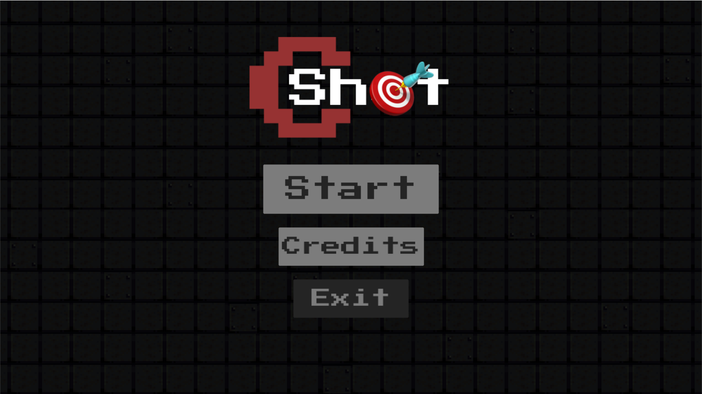
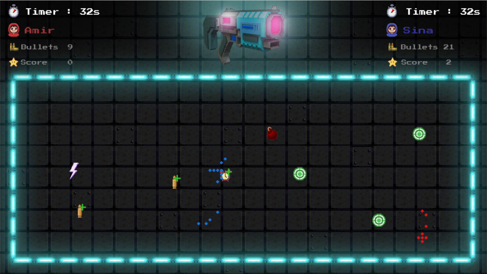

# CShot

CShot is a unique and challenging 2-player shooting game where players must aim and shoot without knowing their exact crosshair position. Precision, intuition, and strategy are key to winning in this fast-paced game!

## 🎯 Game Concept
In CShot, your crosshair is hidden, meaning you have to guess its position based on movement and past shots. The game tests your ability to estimate and adjust your aim, making every shot a thrilling challenge.

## 🕹️ How to Play
- Each player starts with a limited number of bullets.
- Move your hidden crosshair using the controls.
- Take a shot and adjust your aim based on where the bullet lands.
- Hit targets to score points and compete against your opponent.
- Collect power-ups like the clock icon to extend your time.

## 🎮 Controls
| Action      | Player 1 (Red) | Player 2 (Blue) |
|------------|--------------|----------------|
| Move Crosshair | WASD | Arrow Keys |
| Shoot | Space | Enter |

## 🏆 Game Modes
- 1v1 Multiplayer: Challenge a friend in a competitive match.
- Time Attack: Race against the clock and maximize your score.

## 📸 Screenshots
 

 

## 🔧 Installation & Running the Game
1. Clone the repository:
  
   git clone https://github.com/SLFatemi/CShot.git
   cd CShot
   
2. Run the game executable or open the project in your preferred IDE.

## 🚀 Future Features
- More game modes
- Improved UI and animations

## 🤝 Contributing
Feel free to fork this repository and suggest improvements via pull requests!

## 📜 License
MIT License - See [LICENSE](./LICENSE) for details.
